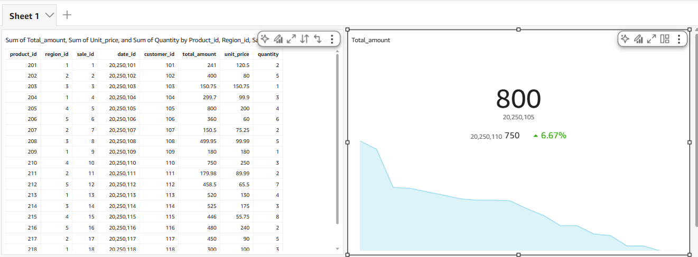
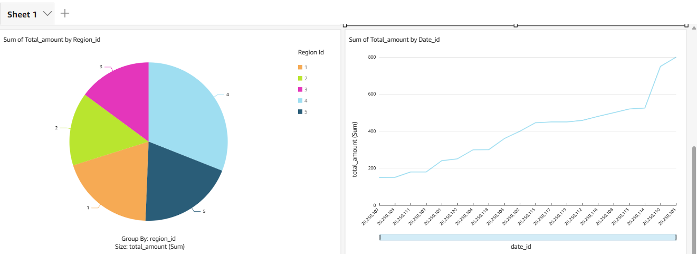
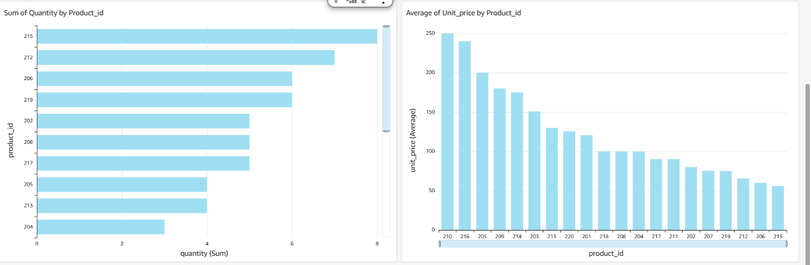

AWS Sales Analytics ETL Project

👤 Author: Sameer 

📅 Date: November 2025

🧠 Goal: Build an end-to-end ETL + Analytics Pipeline using S3 → Glue → Redshift → QuickSight

🧩 Project Overview

This project demonstrates how to design, automate, and visualize a complete data analytics workflow on AWS.
Data from an S3 bucket is processed with AWS Glue, stored in Amazon Redshift, and analyzed with Amazon QuickSight.

🏗️ Architecture Diagram
        ┌────────────┐
        │   CSV Data │
        │  (S3 Bucket)│
        └─────┬──────┘
              │
              ▼
        ┌────────────┐
        │ AWS Glue   │
        │ ETL Job    │
        │ (Transform)│
        └─────┬──────┘
              │
              ▼
        ┌────────────┐
        │ Redshift   │
        │ fact_sales │
        └─────┬──────┘
              │
              ▼
        ┌───────────────┐
        │ QuickSight     │
        │ Dashboard: sam lept │
        └────────────────┘

🧠 Objectives

Automate data ingestion from S3 using AWS Glue

Store transformed data in Amazon Redshift

Build an interactive dashboard in Amazon QuickSight

Visualize KPIs like sales trends, top products, and region performance

⚙️ Technologies Used

AWS Service   Purpose
S3          	Store raw CSV data (fact_sales_sample.csv) 

Glue	        ETL job and schema discovery 

Redshift	Data warehouse

QuickSight	Visualization & BI Dashboard

IAM	Role-based access & permissions

Airflow 	Job orchestration

🧮 Data Source
S3 Bucket:
s3://my-glue-input-bucket-sameer123/fact_sales_sample.csv

Sample Data Columns:

Column Name	 Description
sale_id	        Unique Sale ID 

date_id 	Transaction Date

customer_id	Customer Identifier

product_id	Product Identifier

region_id	Region of Sale

quantity	Units Sold

unit_price	Price per Unit

total_amount	Calculated (quantity * unit_price)

🔧 ETL Steps
Step 1 — AWS S3

Uploaded raw CSV file to S3 bucket (my-glue-input-bucket-sameer123)

Step 2 — AWS Glue

Created Glue Crawler to detect schema

Created Glue ETL Job (red) to load data into Redshift

Validated successful run (20 rows loaded ✅)

Step 3 — Redshift

Table created: fact_sales

Loaded data using SQL:

COPY fact_sales
FROM 's3://my-glue-input-bucket-sameer123/fact_sales_sample.csv'
IAM_ROLE '<your-redshift-iam-role>'

CSV IGNOREHEADER 1;

Step 4 — QuickSight

Connected QuickSight to Redshift (Database: dev)

Imported fact_sales dataset

Built visuals and published dashboard “sam lept”

📊 Dashboard Visuals
Visual	Description
📈 Line Chart	Total Sales Over Time
🥧 Pie Chart	Sales by Region
📊 Bar Chart	Top Selling Products
💰 KPI Metric	Total Revenue + Growth %
📉 Bar Chart	Average Price by Product

---

## 🖼️ Project Screenshots

Below are real screenshots captured from my AWS ETL pipeline and Amazon QuickSight dashboard.

---

### 🔹 Step 1 — AWS QuickSight Dashboard Overview  

  

---

### 🔹 Step 2 — Sales Visualization 1  

  

---

### 🔹 Step 3 — Sales Visualization 2  

  

---

Folder Structure
aws-etl-project/
├── README.md
├── dags/
│   └── glue_redshift_etl_dag.py
├── data/
│   └── fact_sales_sample.csv
├── screenshots/
│   └── (QuickSight & ETL screenshots)
└── requirements.txt

Key Learnings

Set up AWS Glue ETL jobs

Managed IAM roles for cross-service permissions

Loaded data efficiently into Redshift

Created AWS QuickSight dashboards for analytics

🚀 Next Steps

✅ Automate Glue ETL via Airflow
✅ Add more datasets (dim_customer, dim_product)
✅ Explore advanced analytics (e.g., region-based growth KPIs)

🧩 Credits

👨‍💻 Project created by Sameer

🧠 Tools: AWS Console, Ubuntu (WSL), Airflow, QuickSight

Outcome

🎯 Complete AWS ETL & BI Pipeline
📈 Fully deployed & visualized data pipeline
🏆 Ready for Resume & Interview Portfolio
